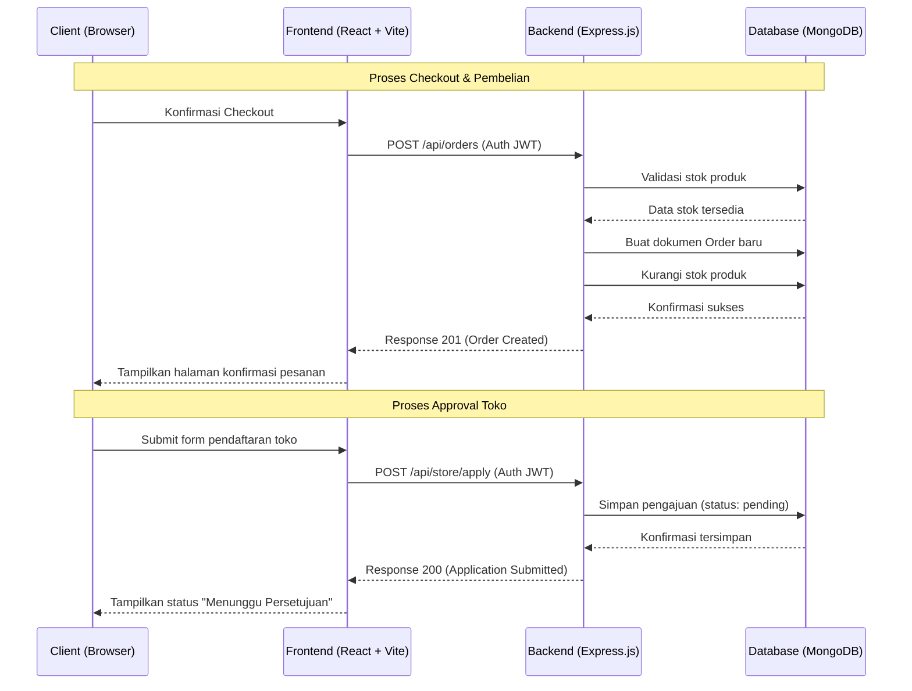
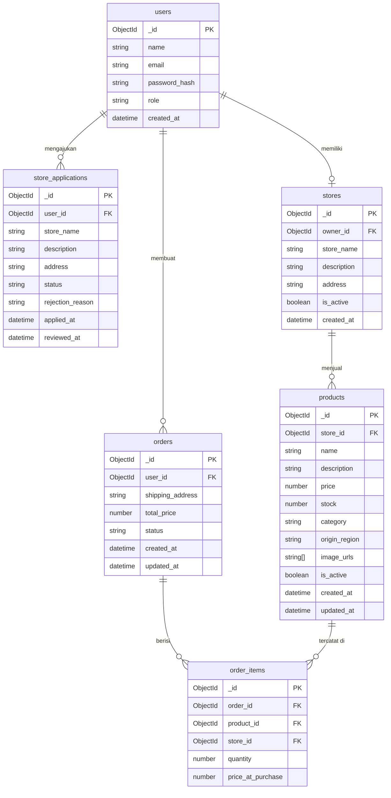

# PRD — Project Requirements Document

## 1. Overview

SobatBatik adalah platform e-commerce berbasis web yang dirancang khusus untuk memfasilitasi penjualan produk batik Indonesia secara digital. Masalah utama yang ingin diselesaikan adalah keterbatasan jangkauan pasar para pengrajin dan penjual batik lokal yang masih mengandalkan penjualan konvensional, serta sulitnya konsumen menemukan produk batik autentik dari berbagai daerah dalam satu platform terpusat.

Tujuan utama aplikasi adalah menyediakan ekosistem digital yang menghubungkan **Pembeli (User)**, **Toko/Penjual**, dan **Administrator** dalam satu platform yang terintegrasi. Pembeli dapat menemukan dan membeli produk batik dengan mudah, penjual dapat mengelola toko dan memantau performa produknya, sementara administrator memastikan ekosistem berjalan dengan sehat melalui pengawasan dan proses approval pendaftaran toko.

## 2. Requirements

Berikut adalah persyaratan tingkat tinggi untuk pengembangan sistem:

- **Aksesibilitas:** Aplikasi harus dapat diakses melalui Web Browser (desktop dan mobile).
- **Pengguna:** Sistem mendukung tiga role: **User/Pembeli**, **Toko/Penjual**, dan **Administrator**.
- **Registrasi Toko:** Calon penjual harus mengajukan permohonan menjadi toko dan menunggu approval dari Administrator.
- **Penolakan Berargumen:** Jika Administrator menolak pengajuan toko, sistem wajib menyertakan alasan penolakan yang dapat dilihat oleh pemohon.
- **Transaksi:** Proses pembelian mencakup keranjang belanja, checkout, dan riwayat pesanan.
- **Manajemen Produk:** Toko memiliki akses penuh untuk CRUD produk miliknya sendiri.
- **Visualisasi Data Toko:** Dashboard toko menampilkan data analitik penjualan seperti produk terlaris, tren pendapatan, dan jumlah pesanan.
- **Monitoring Admin:** Administrator dapat memantau seluruh aktivitas platform tanpa melakukan intervensi pada data transaksi.

## 3. Core Features

Fitur-fitur kunci yang harus ada dalam versi pertama (MVP), dikelompokkan berdasarkan role:

### 3.1 Role: User / Pembeli

1. **Registrasi & Login**
   - Daftar akun menggunakan email dan password.
   - Login dengan autentikasi JWT.

2. **Halaman Utama & Pencarian Produk**
   - Tampilan produk batik dari semua toko yang aktif.
   - Fitur pencarian berdasarkan nama produk, asal daerah, atau nama toko.
   - Filter produk berdasarkan kategori, harga, dan rating.

3. **Detail Produk**
   - Halaman detail produk menampilkan foto, deskripsi, harga, stok, dan informasi toko.

4. **Keranjang Belanja (Cart)**
   - Tambah produk ke keranjang.
   - Update jumlah atau hapus item dari keranjang.

5. **Checkout & Pembayaran**
   - Input alamat pengiriman.
   - Konfirmasi ringkasan pesanan sebelum pembayaran.
   - Simulasi pembayaran (opsional untuk MVP: integrasi payment gateway).

6. **Riwayat Pesanan**
   - Daftar seluruh transaksi yang pernah dilakukan beserta status pesanan.

### 3.2 Role: Toko / Penjual

1. **Pendaftaran & Approval**
   - Pengguna mengajukan permohonan untuk menjadi penjual dengan mengisi data profil toko.
   - Status pengajuan dapat dipantau (Menunggu, Disetujui, Ditolak).
   - Jika ditolak, pemohon menerima notifikasi beserta **alasan penolakan** dari Administrator.

2. **Manajemen Produk (CRUD)**
   - Tambah produk baru dengan data: nama, deskripsi, harga, stok, kategori, asal daerah, dan foto.
   - Edit dan hapus produk yang sudah ada.
   - Kelola status produk (aktif/nonaktif).

3. **Manajemen Pesanan**
   - Lihat daftar pesanan masuk.
   - Update status pesanan (Dikemas, Dikirim, Selesai).

4. **Dashboard Analitik Toko**
   - **Produk Terlaris:** Visualisasi bar chart produk dengan penjualan tertinggi.
   - **Tren Pendapatan:** Line chart pendapatan harian/mingguan/bulanan.
   - **Ringkasan Pesanan:** Jumlah pesanan berdasarkan status (Baru, Diproses, Selesai).
   - **Statistik Produk:** Total produk aktif, total stok tersedia.

### 3.3 Role: Administrator

1. **Dashboard Monitoring Platform**
   - Ringkasan total pengguna terdaftar, total toko aktif, dan total transaksi platform.
   - Grafik pertumbuhan pengguna dan transaksi.

2. **Approval Pendaftaran Toko**
   - Lihat daftar pengajuan toko yang masuk dengan status Menunggu.
   - Tombol **Setujui** atau **Tolak** untuk setiap pengajuan.
   - Jika memilih **Tolak**, Administrator wajib mengisi form alasan penolakan yang akan dikirimkan ke pemohon.

3. **Pemantauan Pengguna**
   - Lihat daftar seluruh pengguna terdaftar beserta role dan status akun.

4. **Pemantauan Toko**
   - Lihat daftar seluruh toko aktif beserta informasi dasar dan statistik ringkas.

5. **Pemantauan Transaksi**
   - Lihat log transaksi yang terjadi di seluruh platform (read-only).

## 4. User Flow

### 4.1 Alur Pembeli

1. **Registrasi/Login:** User mendaftar atau masuk ke akun.
2. **Jelajah Produk:** User menelusuri produk di halaman utama atau menggunakan fitur pencarian.
3. **Tambah ke Keranjang:** User memilih produk dan menambahkannya ke keranjang.
4. **Checkout:** User mengisi alamat, mengonfirmasi pesanan, dan melakukan pembayaran.
5. **Konfirmasi:** Sistem mencatat pesanan dan memperbarui stok produk secara otomatis.
6. **Pantau Pesanan:** User memantau status pengiriman di riwayat pesanan.

### 4.2 Alur Pendaftaran Toko

1. **Ajukan Permohonan:** Pengguna mengisi form pendaftaran toko (nama toko, deskripsi, alamat).
2. **Menunggu Review:** Status pengajuan tercatat sebagai "Menunggu".
3. **Administrator Meninjau:** Admin melihat pengajuan dan memutuskan menyetujui atau menolak.
   - Jika **Disetujui:** Role pengguna berubah menjadi Toko dan akses dashboard toko terbuka.
   - Jika **Ditolak:** Pengguna menerima notifikasi berisi alasan penolakan dari Administrator.
4. **Kelola Toko:** Toko yang disetujui langsung dapat menambahkan produk dan menerima pesanan.

### 4.3 Alur Administrator

1. **Login:** Admin masuk menggunakan kredensial khusus administrator.
2. **Monitoring:** Admin melihat dashboard utama untuk memantau kondisi platform secara keseluruhan.
3. **Proses Approval:** Admin meninjau antrian pengajuan toko dan memberikan keputusan beserta alasan jika menolak.
4. **Pemantauan Berkelanjutan:** Admin secara berkala memeriksa log transaksi, daftar pengguna, dan aktivitas toko.

## 5. Architecture

Berikut adalah gambaran arsitektur sistem dan aliran data secara teknis:

## 6. Database Schema

Berikut adalah Entity Relationship Diagram (ERD) yang menggambarkan struktur database utama (MongoDB Collections):

| Collection | Deskripsi |
|---|---|
| **users** | Data seluruh pengguna dengan role: `user`, `store`, atau `admin` |
| **store_applications** | Pengajuan pendaftaran toko beserta status dan alasan penolakan jika ada |
| **stores** | Data toko yang telah disetujui oleh Administrator |
| **products** | Katalog produk batik milik setiap toko |
| **orders** | Dokumen pesanan yang dibuat oleh pembeli |
| **order_items** | Detail item dalam setiap pesanan (snapshot harga saat transaksi) |

## 7. Design & Technical Constraints

Bagian ini mengatur batasan teknis dan panduan desain yang wajib dipatuhi selama pengembangan.

### 7.1 Technology Stack

| Layer | Teknologi |
|---|---|
| **Frontend** | React.js (Vite) |
| **Backend** | Node.js + Express.js |
| **Database** | MongoDB (dikelola via MongoDB Compass) |
| **ODM** | Mongoose |
| **Autentikasi** | JWT (JSON Web Token) |
| **UI Framework** | Tailwind CSS v4 + shadcn/ui |
| **State Management** | Context API atau Zustand |

### 7.2 Authentication & Authorization

- Autentikasi menggunakan **JWT** yang dikirimkan via HTTP Header (`Authorization: Bearer <token>`).
- Setiap route API yang sensitif harus dilindungi oleh middleware verifikasi JWT.
- Akses endpoint dikontrol berdasarkan **role** yang tersimpan di dalam payload JWT (`user`, `store`, `admin`).

### 7.3 API Convention

- Semua endpoint API menggunakan prefix `/api/v1/`.
- Response format standar menggunakan struktur JSON: `{ success, message, data }`.
- Kode HTTP yang digunakan sesuai standar REST: `200`, `201`, `400`, `401`, `403`, `404`, `500`.

### 7.4 Typography Rules

Sistem antarmuka (UI) wajib menggunakan konfigurasi font variable sebagai berikut untuk menjaga konsistensi visual:

- **Sans:** `Geist, ui-sans-serif, system-ui, sans-serif`
- **Serif:** `serif`
- **Mono:** `JetBrains Mono, ui-monospace, monospace`

### 7.5 Design System

- Seluruh komponen UI dibangun di atas **shadcn/ui** untuk menjaga konsistensi dan aksesibilitas.
- Kustomisasi warna menggunakan **CSS Variables** yang didefinisikan melalui konfigurasi Tailwind v4.
- Palet warna utama terinspirasi dari estetika batik Indonesia: nuansa coklat tanah (`#8B4513`), krem (`#F5F0E8`), dan aksen emas (`#D4A017`).